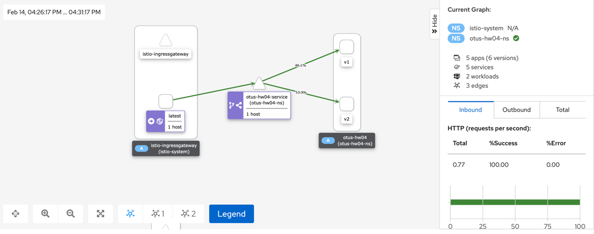

## Installation

Setup Istio

```shell
istioctl install --set profile.html=default -y
```

Setup application deployments
```shell
./launch.sh
```

### Prometheus

```shell
helm repo add prometheus-community https://prometheus-community.github.io/helm-charts
helm repo update
helm install --version 32.0.0 -n monitoring --create-namespace prometheus prometheus-community/kube-prometheus-stack
kubectl apply -f https://raw.githubusercontent.com/istio/istio/release-1.12/samples/addons/prometheus.yaml
```

### Kiali

```shell
helm repo add kiali https://kiali.org/helm-charts
helm repo update
helm install --set auth.strategy="anonymous" kiali-server kiali/kiali-server --version 1.46.0 --namespace istio-system
kubectl apply -f https://raw.githubusercontent.com/istio/istio/release-1.12/samples/addons/kiali.yaml
```

### Additional

Add SideCar to namespace `monitoring` pods

```shell
kubectl label namespace monitoring istio-injection=enabled --overwrite
```

### Send requests

Get access to service

```shell
minikube service -n istio-system istio-ingressgateway
```

Send several requests (just refresh page)

### Result

```shell
istioctl dashboard kiali
```

Traffic management screenshot

