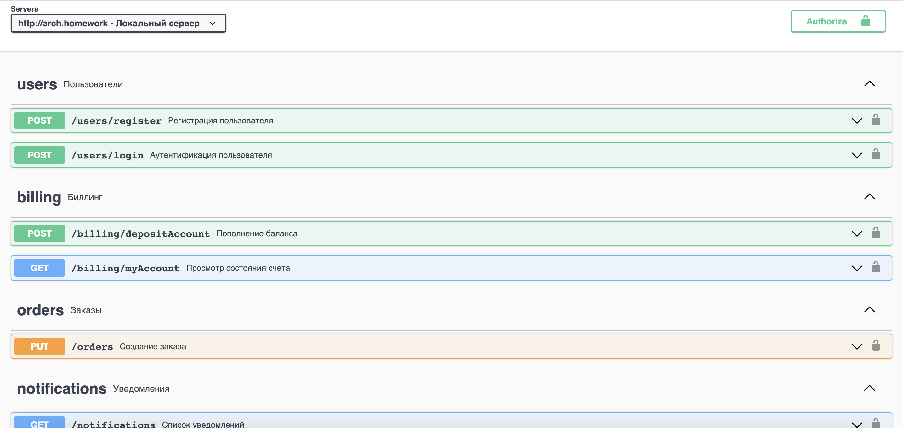

## Table of contents
- [General](#general)
- [Installation](#installation)
- [Testing](#testing)
- [TODO](#todo)

### General

Service collaboration schema


[OpenAPI spec](./api-spec/static/open-api.yaml)



### Installation

Create a namespace

```shell
kubectl create namespace otus-hw06
```

Select created namespace

```shell
kubectl config set-context --current --namespace=otus-hw06
```

Install and setup kafka
```shell
helm repo add bitnami https://charts.bitnami.com/bitnami
helm install kafka bitnami/kafka -f kafka/config.yaml
```

Install postgres and setup user-app

```shell
cd user
helm install user-db bitnami/postgresql -f database/postgres/config.yaml
helm install user-app application/.helm
```

Install postgres and setup billing-app
```shell
cd billing
helm install billing-db bitnami/postgresql -f database/postgres/config.yaml
helm install billing-app application/.helm
```

Install postgres and setup order-app
```shell
cd order
helm install order-db bitnami/postgresql -f database/postgres/config.yaml
helm install order-app application/.helm
```

Install postgres and setup notification-app
```shell
cd notification
helm install notification-db bitnami/postgresql -f database/postgres/config.yaml
helm install notification-app application/.helm
```

Setup Api Gateway
```shell
kubectl apply -f api-gateway/ingress.yaml
```

### Testing

Run Postman test scenario

```shell
bash .postman-test.sh
```

### TODO

- Common naming enhancements
- Setup liveness/readiness probes
- Setup HPA
- Setup grafana/prometheus
- Collect metrics