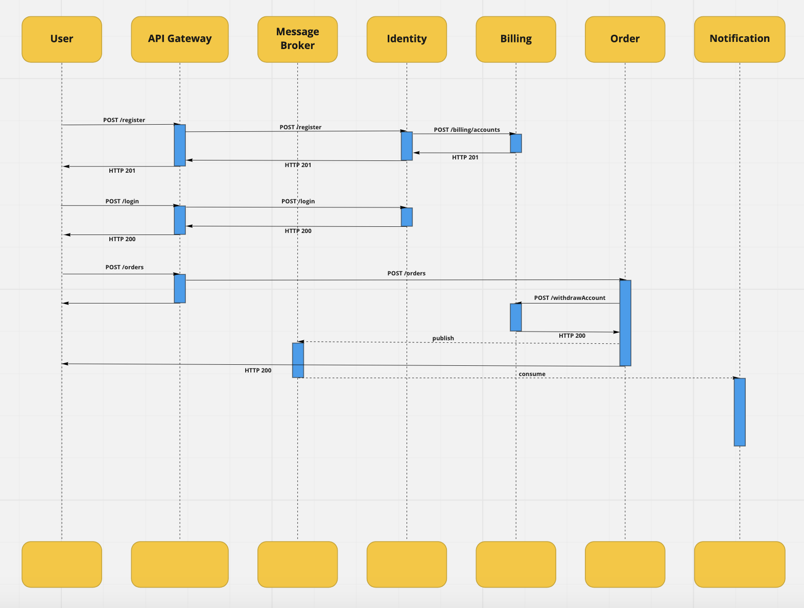

# Интернет-магазин

Приложение позволяет заказывать товары в интернет магазине

## Пользовательские сценарии

- Я как пользователь могу зарегистрироваться в интернет-магазине
- Я как пользователь могу авторизоваться в интернет-магазине
- Я как пользователь могу пополнить баланс своего счёта
- Я как пользователь могу получить баланс своего счёта
- Я как пользователь могу создать заказ
- Я как пользователь могу получить список уведомлений о заказах

### Предметные области

- Пользователь
- Заказ
- Уведомление
- Счёт

### Системные действия

- Регистрация
- Авторизация
- Пополнение счёта
- Получение баланса 
- Создание заказа
- Получение уведомлений

## Сервисы

- Сервис «Пользователи»
- Сервис «Биллинг»
- Сервис «Заказов»
- Сервис «Уведомлений»

## Спецификация OpenAPI

[OpenAPI.yaml](https://github.com/khaydarov/otus-microservices/blob/main/hw08/open-api.yaml)

## Схема взаимодействия

---
### Сервис «Пользователи»

**Описание**

Сервис предоставляет API для работы с пользователями: регистрация, аутентификация и обновление информации про пользователя

**Запросы**

- None

**Команды**

- `POST /api/v1/users/register` — регистрация нового пользователя
- `PUT  /api/v1/users/{id}` — обновление информации пользователя
- `POST /api/v1/users/login` — аутентификация

**События**

- None

**Пробы**

- `GET /api/v1/users/health` — возвращает состояние сервиса

**Зависимости**

- Вызывает метод создания аккаунта в сервисе биллинга `POST /api/v1/billing/account` 

---
### Сервис «Биллинг»

**Описание**

Сервис предоставляет API для работы со счетом пользователя: создание счета, пополнение и списание

**Запросы**

- `GET /api/v1/billing/account/my` — отображает состояние счёта (баланса)

**Команды**

- `POST /api/v1/billing/account` — создание счёта
- `POST /api/v1/billing/account/deposit` — пополнение баланса счёта пользователя
- `POST /api/v1/billing/account/withdraw` — списание денег со счёта пользователя

**События**

- None

**Пробы**

- `GET /api/v1/billing/health` — возвращает состояние сервиса

**Зависимости**

- None

---

### Сервис «Заказы»

**Описание**

Сервис предоставляет API для работы с заказами

**Запросы**

- `GET /api/v1/orders` — отображает все заказы пользователя

**Команды**

- `POST /api/v1/orders` — создание заказа

**События**

- `OrderCreated` — событие при успешном создании заказа
- `OrderNotCreated` — событие при неуспешном создании заказа (не хватило денег)

**Пробы**

- `GET /api/v1/orders/health` — возвращает состояние сервиса

**Зависимости**

- Вызывает метод списание денег со счёта пользователя в сервисе биллинга `POST /api/v1/billing/account/withdraw`

---

### Сервис «Уведомления»

**Описание**

Сервис предоставляет API для работы с уведомлениями

**Запросы**

- `GET /api/v1/notifications` — отображает все уведомления пользователя

**Команды**

- None

**События**

- None

**Пробы**

- `GET /api/v1/notifications/health` — возвращает состояние сервиса

**Зависимости**

- Обрабатывает событие `OrderCreated`
- Обрабатывает событие `OrderNotCreated`